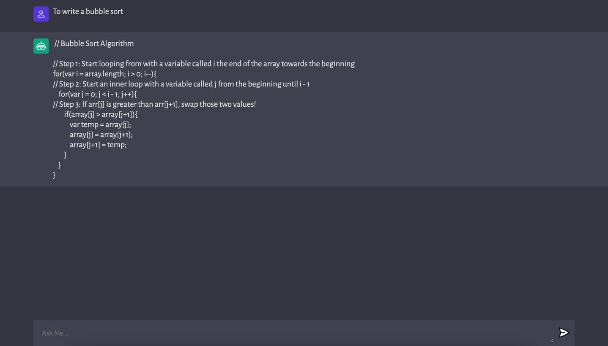

# Coding_Bot

A vanilla js web app that call OPenAI API of text-davinci-003 to generate code based on the description of the problem.
## Demo
<br>


## How to Run

To run on local:

```bash
  $ cd server
  $ npm install 
  $ npm run server
```
Open another terminal:
```bash
  $ cd client
  $ npm install 
  $ npm run dev
```

If npm not install, to download node.js

---

## API Setup

In order to use the OpenAI API, you need to sign up on OpenAI and get your API key from https://platform.openai.com/. 
Once you have your key, add it to your `.env` file:

```bash
OPENAI_API_KEY = "your_api_key_here"
```

Remember to replace "your_api_key_here" with your actual API key.

## Usage

Once the project is up and running both server and client, 
you can start using the coding bot.

1. Open your web browser and navigate to `http://localhost:3000`.
2. You will see an input field. 
